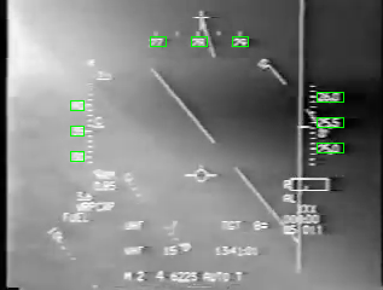

# F16 Indicator Tracker

This project tracks Airspeed Indicator, Altimeter, and Compass of F16 HUD, especially for F16 HUD Footage of Package Q Strike on 19th January, 1991. As for the tracking of attitude indicator, please see [F16-Attitude-Logger](https://github.com/ynyBonfennil/F16-Attitude-Logger).

Mainly written in C++ with OpenCV, but data clean-up script is written in Python.

